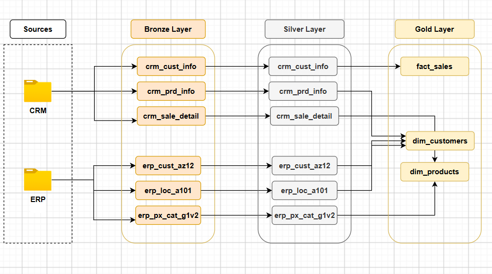

# SQL Data Warehouse


-informational)


Data warehouse SQL Server de bout en bout : ingestion de fichiers CSV bruts
(CRM, ERP), nettoyage et normalisation, puis modélisation en étoile prête
pour le reporting analytique.



Reprise personnelle du projet **[SQL Data Warehouse from Scratch](https://www.youtube.com/watch?v=9GVqKuTVANE&list=PLNcg_FV9n7qaUWeyUkPfiVtMbKlrfMqA8)**
(Data with Baraa), adaptée et réécrite à ma façon.

## Sommaire

- [À propos](#à-propos)
- [Points clés](#points-clés)
- [Architecture](#architecture)
- [Modèle de données](#modèle-de-données)
- [Pipeline ETL](#pipeline-etl)
- [Règles de qualité des données](#règles-de-qualité-des-données)
- [Stack technique](#stack-technique)
- [Structure du projet](#structure-du-projet)
- [Démarrage rapide](#démarrage-rapide)
- [Documentation](#documentation)
- [Suivi d'avancement](#suivi-davancement)
- [Licence](#licence)
- [Remerciements](#remerciements)

## À propos

Ce projet simule un cas réel d'ingénierie de données : deux systèmes source
hétérogènes (un CRM et un ERP, exportés en CSV) sont ingérés, nettoyés puis
consolidés dans un entrepôt de données SQL Server, jusqu'à un modèle en
étoile exploitable par des outils de BI/reporting.

L'accent est mis sur des pratiques d'un vrai pipeline ETL plutôt que sur un
simple exercice de requêtes : architecture en couches, procédures stockées
idempotentes, journalisation de l'exécution, gestion d'erreurs, et
documentation du modèle de données.

## Points clés

- **Architecture médaillon** (Bronze / Silver / Gold) avec séparation nette
  entre ingestion brute, nettoyage et couche de consommation.
- **Procédures stockées idempotentes** (`bronze.load_bronze`,
  `silver.load_silver`) : `TRUNCATE` + rechargement complet, avec mesure du
  temps d'exécution par table et gestion d'erreurs `TRY...CATCH`.
- **Règles de nettoyage explicites** : dédoublonnage par fenêtre (`ROW_NUMBER`),
  standardisation des codes métier (genre, statut marital, pays, ligne de
  produit), recalcul des montants de vente incohérents, validation des dates.
- **Historisation des produits** : reconstruction de la date de fin de
  validité (`prd_end_dt`) par `LEAD()` sur la clé produit, pour ne garder en
  Gold que la version active.
- **Modèle en étoile** avec clés de substitution générées en Gold
  (`ROW_NUMBER`), découplées des identifiants métier des systèmes source.
- **Documentation versionnée** : schéma de flux et
  [dictionnaire de données](docs/dictionnaire_donnees.md) tenus à jour avec
  le code.

## Architecture

```
Sources CSV (CRM, ERP)
        │
        ▼
  ┌───────────┐   ingestion brute, sans transformation
  │  Bronze   │   (fichiers CSV → tables SQL Server, tel quel)
  └───────────┘
        │
        ▼
  ┌───────────┐   nettoyage, standardisation, normalisation
  │  Silver   │   (dédoublonnage, typage, règles métier)
  └───────────┘
        │
        ▼
  ┌───────────┐   modèle en étoile (faits / dimensions)
  │   Gold    │   prêt pour le reporting et l'analyse
  └───────────┘
```

| Couche | Rôle | Objets |
|---|---|---|
| **Bronze** | Ingestion brute des CSV, sans transformation | Tables `bronze.*` |
| **Silver** | Nettoyage, dédoublonnage, standardisation, typage | Tables `silver.*` |
| **Gold** | Modèle en étoile prêt pour l'analyse | Vues `gold.*` |

## Modèle de données

La couche Gold expose un schéma en étoile : une table de faits des ventes
reliée à deux dimensions via des clés de substitution.

| Objet | Type | Grain | Description |
|---|---|---|---|
| `gold.dim_customer` | Dimension | 1 ligne / client | Identité, démographie, localisation (CRM + ERP) |
| `gold.dim_product` | Dimension | 1 ligne / produit actif | Référence, catégorie, coût, ligne de produit |
| `gold.fact_sales` | Fait | 1 ligne / ligne de commande | Quantités, prix, montants, dates de commande |

Détail complet des colonnes, types et domaines de valeurs :
**[dictionnaire de données](docs/dictionnaire_donnees.md)**.

## Pipeline ETL

| Étape | Script | Action |
|---|---|---|
| 1 | `scripts/bronze/init_database.sql` | Crée la base `DataWarehouse` et les schémas `bronze` / `silver` / `gold` |
| 2 | `scripts/bronze/ddl_source_crm_tables.sql`, `ddl_source_erp_tables.sql` | Crée les tables brutes Bronze (types calqués sur les fichiers source) |
| 3 | `scripts/bronze/insertion_tables.sql` | Crée `bronze.load_bronze` : `BULK INSERT` des 6 fichiers CSV, avec logs et gestion d'erreurs |
| 4 | `scripts/silver/ddl_silver.sql` | Crée les tables Silver (typées, avec colonne technique `dwh_create_date`) |
| 5 | `scripts/silver/clean_crm_*.sql` | Nettoie et charge les tables CRM (client, produit, ventes) |
| 6 | `scripts/silver/clean_erp_files_script.sql` | Crée `silver.load_silver` : nettoie et charge les tables ERP, avec logs et gestion d'erreurs |
| 7 | `scripts/gold/ddl_dim_cust_gold.sql`, `ddl_dim_product_gold.sql`, `ddl_fact_sales.sql` | Crée les vues Gold (dimensions + fait) |

Les deux procédures stockées (`bronze.load_bronze`, `silver.load_silver`)
tronquent puis rechargent entièrement leurs tables à chaque exécution,
impriment la durée et le nombre de lignes chargées par table, et
remontent une erreur structurée (numéro, message, ligne) en cas d'échec.

## Règles de qualité des données

Appliquées en couche Silver, avant exposition en Gold :

- **Dédoublonnage** : conservation de la fiche client la plus récente par
  `cst_id` (`ROW_NUMBER()` sur `cst_create_date`).
- **Standardisation des codes** : `M`/`F` → `Male`/`Female`,
  `M`/`S` → `Married`/`Single`, codes pays (`DE`, `US`/`USA`) → noms complets,
  codes ligne de produit (`M`, `R`, `S`, `T`) → libellés métier.
- **Valeurs manquantes** : chaînes vides/`NULL` remplacées par `'N/A'`
  (`COALESCE`/`NULLIF`), coûts manquants ramenés à `0`.
- **Validation des dates** : dates de naissance futures invalidées,
  dates de vente rejetées si non conformes au format `YYYYMMDD`.
- **Cohérence des montants** : `sales_amount` recalculé
  (`quantity × |price|`) s'il est manquant, négatif ou incohérent avec
  `quantity`/`price` ; `price` reconstruit à partir de `sales_amount` si
  absent ou invalide.
- **Historisation produit** : `prd_end_dt` recalculé par `LEAD()` pour que
  chaque version de produit ait une date de fin cohérente.

## Stack technique

| Usage | Technologie |
|---|---|
| Base de données | SQL Server |
| Client SQL | SQL Server Management Studio (SSMS) / DBeaver |
| Ingestion | `BULK INSERT` |
| Modélisation | Schéma en étoile (faits / dimensions) |
| Contrôle de version | Git |

## Structure du projet

```
SQL_data_warehouse/
├── datasets/
│   ├── source_crm/        cust_info.csv, prd_info.csv, sales_details.csv
│   └── source_erp/        CUST_AZ12.csv, LOC_A101.csv, PX_CAT_G1V2.csv
├── docs/
│   ├── data_flow.png              schéma de flux Sources → Bronze → Silver → Gold
│   └── dictionnaire_donnees.md    dictionnaire de données de la couche Gold
├── scripts/
│   ├── bronze/             init DB, DDL des tables brutes, procédure de chargement
│   ├── silver/             DDL, scripts de nettoyage, procédure de chargement ERP
│   └── gold/               vues du modèle en étoile (dimensions + fait)
├── tests/                  tests de qualité des données et du pipeline (à venir)
├── LICENSE
└── README.md
```

## Démarrage rapide

### Prérequis

- SQL Server (Express ou supérieur)
- SSMS ou DBeaver pour exécuter les scripts

### Installation

```sql
-- 1. Créer la base et les schémas
:r scripts/bronze/init_database.sql

-- 2. Créer les tables Bronze
:r scripts/bronze/ddl_source_crm_tables.sql
:r scripts/bronze/ddl_source_erp_tables.sql

-- 3. Créer et exécuter le chargement Bronze
:r scripts/bronze/insertion_tables.sql
EXEC bronze.load_bronze;

-- 4. Créer les tables Silver puis charger les données CRM
:r scripts/silver/ddl_silver.sql
:r scripts/silver/clean_crm_cust_info.sql
:r scripts/silver/clean_crm_prd_info.sql
:r scripts/silver/clean_crm_sales_details.sql

-- 5. Créer et exécuter le chargement Silver (données ERP)
:r scripts/silver/clean_erp_files_script.sql
EXEC silver.load_silver;

-- 6. Créer les vues Gold
:r scripts/gold/ddl_dim_cust_gold.sql
:r scripts/gold/ddl_dim_product_gold.sql
:r scripts/gold/ddl_fact_sales.sql
```

> ⚠️ **À adapter** : `scripts/bronze/insertion_tables.sql` référence les
> fichiers CSV via un chemin absolu local
> (`C:\Users\ronic\Desktop\SQL_data_warehouse\datasets\...`). Mets ce
> chemin à jour selon l'emplacement du dépôt sur ta machine avant
> d'exécuter `bronze.load_bronze`.

Une fois les trois couches en place, le reporting se fait directement sur
le schéma `gold` :

```sql
SELECT TOP 10 *
FROM gold.fact_sales;
```

## Documentation

- [Dictionnaire de données](docs/dictionnaire_donnees.md) — colonnes, types
  et domaines de valeurs des objets Gold.
- [docs/data_flow.png](docs/data_flow.png) — schéma de flux détaillé par
  couche et par table.

## Suivi d'avancement

- [x] Couche Bronze — ingestion des CSV source, procédure de chargement journalisée
- [x] Couche Silver — nettoyage, normalisation, procédure de chargement journalisée
- [x] Couche Gold — modèle en étoile (dimensions client/produit, fait ventes)
- [x] Documentation — schéma de flux et dictionnaire de données
- [ ] Tests automatisés de qualité des données

## Licence

Distribué sous licence [MIT](LICENSE).

## Remerciements

Tutoriel original : [Data with Baraa — SQL Data Warehouse from Scratch](https://www.youtube.com/watch?v=9GVqKuTVANE&list=PLNcg_FV9n7qaUWeyUkPfiVtMbKlrfMqA8)
