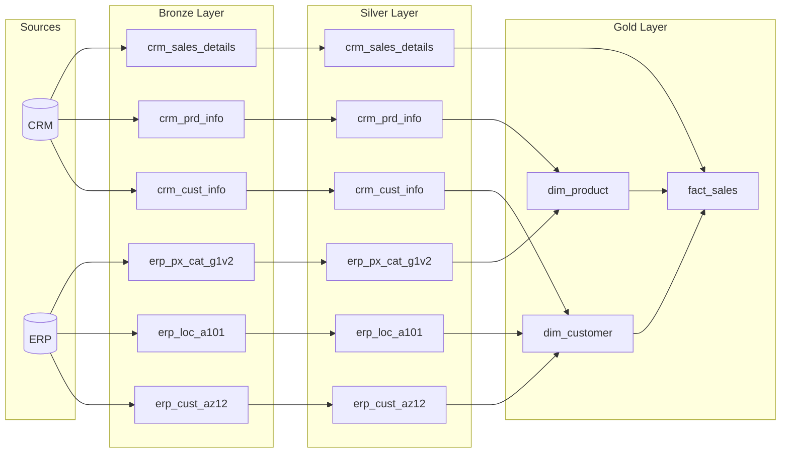

# SQL_data_warehouse

Reprise personnelle du projet **[SQL Data Warehouse from Scratch](https://www.youtube.com/watch?v=9GVqKuTVANE&list=PLNcg_FV9n7qaUWeyUkPfiVtMbKlrfMqA8)**
(Data with Baraa) : construction d'un data warehouse SQL Server de bout
en bout, de l'ingestion de fichiers CSV bruts jusqu'à un modèle en
étoile prêt pour le reporting.

## Objectif

Suivre puis reproduire à ma façon l'architecture **médaillon**
(Bronze / Silver / Gold), en insistant sur les pratiques réelles
d'un projet d'ingénierie de données : pipelines ETL, nettoyage et
normalisation, modélisation dimensionnelle.

## Architecture

```
Sources CSV (CRM, ERP)
        │
        ▼
  ┌───────────┐   ingestion brute, sans transformation
  │  Bronze   │   (fichiers CSV → tables SQL Server, tel quel)
  └───────────┘
        │
        ▼
  ┌───────────┐   nettoyage, standardisation, normalisation
  │  Silver   │   (dédoublonnage, typage, règles métier)
  └───────────┘
        │
        ▼
  ┌───────────┐   modèle en étoile (faits / dimensions)
  │   Gold    │   prêt pour le reporting et l'analyse
  └───────────┘
```

## Flux de données détaillé



Détail des colonnes de la couche Gold : [dictionnaire de données](docs/dictionnaire_donnees.md).

## Stack technique

| Usage | Technologie |
|---|---|
| Base de données | SQL Server |
| Client SQL | SQL Server Management Studio (SSMS) / DBeaver |
| Modélisation | Schéma en étoile (faits / dimensions) |
| Contrôle de version | Git |

## Structure du projet

```
SQL_data_warehouse/
├── datasets/             fichiers sources CSV (CRM, ERP)
├── docs/                 diagrammes d'architecture et de flux de données
├── scripts/
│   ├── bronze/           scripts de création et chargement (couche Bronze)
│   ├── silver/           scripts de nettoyage et transformation (couche Silver)
│   └── gold/             vues du modèle en étoile (couche Gold)
├── tests/                tests de qualité des données et du pipeline
├── LICENSE
└── README.md
```

## Suivi d'avancement

- [ ] Couche Bronze — ingestion des CSV source
- [ ] Couche Silver — nettoyage et normalisation
- [ ] Couche Gold — modèle en étoile (faits / dimensions)
- [ ] Documentation et diagrammes

## Source

Tutoriel original : [Data with Baraa — SQL Data Warehouse from Scratch](https://www.youtube.com/watch?v=9GVqKuTVANE&list=PLNcg_FV9n7qaUWeyUkPfiVtMbKlrfMqA8)
